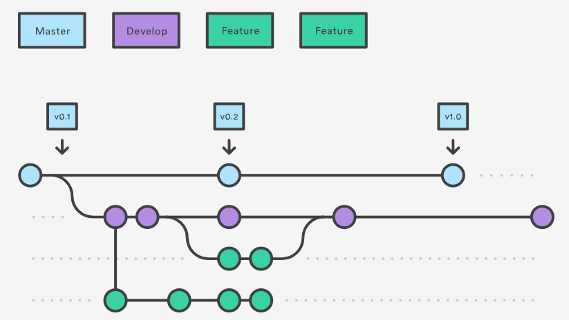

# climate-tft

https://okskmk2.github.io/climate-tft/

# Installation 설치 안내

npm install

# Getting Started 사용법

npm run start - 서버 실행

# Git Branch Workflows 깃 브랜치

# File Manifest 파일 정보 및 목록

Vue, firebase ...

# Copyright / End User License 저작권 및 사용권 저보

# Contact Information 배포자 및 개발자의 연락처 정보
